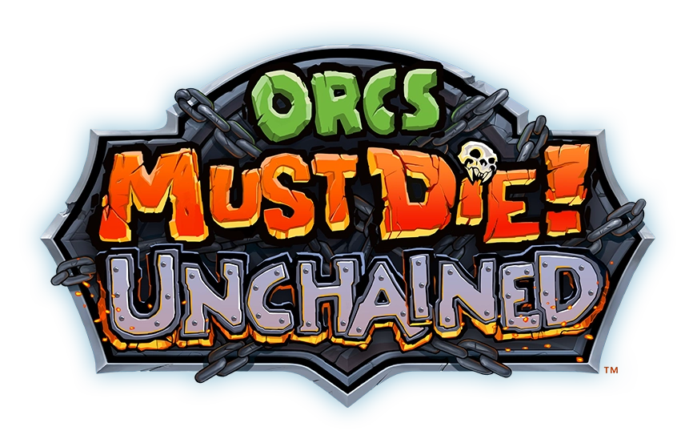

# Welcome to Orcs Must Read Unchained!
I created this small website to help my friends and I set up survival mode loadouts for [Project Rechained](https://github.com/TimeMaster18/Project-Rechained), a fan-made revival of Orcs Must Die! What began as a personal project ended up being useful to more people than I anticipated, so I'm now working on expanding the site for a broader audience. I hope it helps you get more familiar with the game and enhances your experience.

## Installing the game
To get started playing the game, follow the installation instructions on [Project Rechained's GitHub page](https://github.com/TimeMaster18/Project-Rechained).

## Looking for a group?
Looking for a group to play with? Join [Project Unchained's Discord server](https://discord.gg/xkZskPXtwm), where you'll find dedicated LFG channels and roles.

## Fair Use / Fair Dealing Disclaimer
This website is a fan-made project dedicated to Orcs Must Die! Unchained, a discontinued game originally developed and published by [Robot Entertainment](https://robotentertainment.com/). The images, logos, and other copyrighted materials used on this site are the property of their respective owners.

The use of these materials is done in accordance with applicable EU copyright laws, including exceptions for non-commercial, educational, and archival purposes as outlined in the EU Copyright Directive (Directive 2019/790) and relevant national laws. This website is not affiliated with, endorsed by, or sponsored by Robot Entertainment. No copyright infringement is intended.

If you are a rights holder and believe any content should be removed or modified, please contact me at [tripledutch19@gmail.com](mailto:tripledutch19@gmail.com), and I will address your concerns promptly.